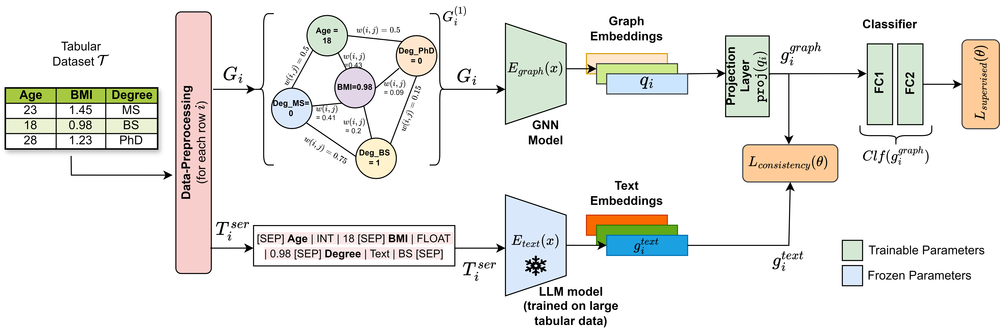

# TabGLM: A Framework for Tabular Graph-Language Modeling 
This repository contains the official codebase for our AAAI 2025 paper "**TabGLM: Tabular Graph Language Model for Learning Transferable Representations Through Multi-Modal Consistency Minimization**".



Handling heterogeneous data in tabular datasets poses a significant challenge for deep learning models. While attention-based architectures and self-supervised learning have achieved notable success, their application to tabular data remains less effective over linear and tree based models.
Although several breakthroughs have been achieved by models which transform tables into uni-modal transformations like image, language and graph, these models often underperform in the presence of feature heterogeneity.
To address this gap, we introduce **TabGLM**(**Tab**ular **G**raph **L**anguage **M**odel), a novel multi-modal architecture designed to model both structural and semantic information from a table. 
TabGLM transforms each row of a table into a fully connected graph and serialized text, which are then encoded using a graph neural network (GNN) and a text encoder, respectively. By aligning these representations through a joint, multi-modal, self-supervised learning objective, TabGLM leverages complementary information from both modalities, thereby enhancing feature learning.
TabGLM's flexible graph-text pipeline efficiently processes heterogeneous datasets with significantly fewer parameters over existing Deep Learning approaches. 

## Installation

Before executing training and evaluation we create the virtual environment following the steps below - 
```bash
conda create --name tabglm python=3.12.4
conda activate tabglm
conda install pytorch==2.2.2 torchvision==0.17.2 torchaudio==2.2.2 pytorch-cuda=11.8 -c pytorch -c nvidia
pip install "pytorch_tabular"

sudo apt-get install jq

git clone <REPO_URL>.git
cd TabGLM

pip install -e .
```

**Note**: We have tested our code for CUDA toolkit 11.8, 12.1 and 12.4. 

## Experiment Configurations

All configurations are located in the ```configs``` directory with file structures as described below. Before running the model, ensure that the configurations are set to your preference including dataset details and training parameters.

```
configs/
    config_<dataset_name>.yml
```

## Training and Evaluation
In this section we provide the training and evaluation strategy for training the TabGLM architecture alongside other tabular ML and DL architectures.

### (a) TabGLM
To perform training and evaluation follow the following steps.

```bash
CUDA_VISIBLE_DEVICES=<GPU_IDs> python run.py <CONFG_FILE>
```

```GPU_IDs``` - Comma separated integers indicating the GPUs to train on. TabGLM supports multi-GPU training.

```CONFIG_FILE``` - Config file demonstrating data, training and evaluation parameters for each dataset.

To Execute all experiments (subject to resource availability) please use the below command.

```
bash run_all_experiments.sh <GPU_IDs> <BATCH_SIZE>
```

There are two key command line arguments -

```GPU_IDs``` represent comma separated list of GPUs.

```BATCH_SIZE``` represents the number of records in a batch (vary based on GPU capacity).

### (b) Traditional ML models
We support experimentation on traditional Machine Learning (ML) models like - CatBoost, XGBoost, Logistic Regression (LR). We perform training and evaluation by following the below steps.

```bash
CUDA_VISIBLE_DEVICES=<GPU_IDs> python run_ml.py <CONFG_FILE>
```

```GPU_IDs``` - Comma separated integers indicating the GPUs to train on. TabGLM supports multi-GPU training.

```CONFIG_FILE``` - Config file demonstrating data, training and evaluation parameters for each dataset.

The aforementioned script executes all 4 ML models each for 5 different seed values and stores the results into a wandb channel.

### (c) Tabular DL models
To perform training and evaluation on tabular Deep-Learning Models TabTransformer, FT-Transformer and NODE, follow the following steps.

```bash
CUDA_VISIBLE_DEVICES=<GPU_IDs> python run_tab_dl.py <CONFG_FILE> <MODEL_NAME>[Tab-transformer | FT-transformer | NODE]
```

```GPU_IDs``` - Comma separated integers indicating the GPUs to train on. TabGLM supports multi-GPU training.

```CONFIG_FILE``` - Config file demonstrating data, training and evaluation parameters for each dataset.

```MODEL_NAME``` - Name of the model to be used for the experiment.

## Citation
Please cite our work using the below citation - 
```
@inproceedings{majee2025tabglm,
    title={Tab{GLM}: Tabular Graph Language Model for Learning Transferable Representations through Multi-Modal Consistency Minimization},
    author={Anay Majee, Maria Xenochristou, Wei-Peng Chen},
    booktitle={The 39th Annual AAAI Conference on Artificial Intelligence},
    year={2025}
}
```